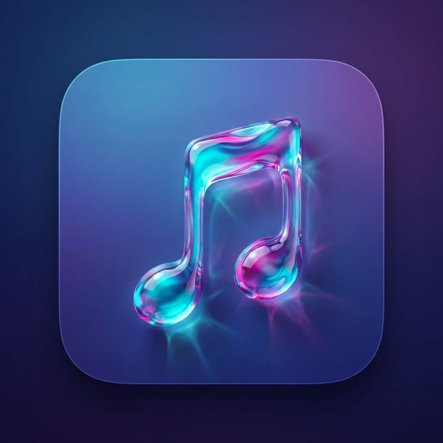

# MiniPlayer For Apple Music

I built this because I really needed a simple, always-on-top mini player for Apple Music on macOS, and nothing else quite fit the vibe. So I made it myself.



## (Features)

- **Always on Top**: A floating window that stays above everything, perfect for coding or chilling.
- **Apple Music Only**: Specifically designed for the native macOS Music app.
- **Zero-Polling**: It uses **0% CPU** when you aren't touching it. It sleeps until the song changes. Your battery will thank you.
- **Liquid Glass UI**: Translucent design that looks great in Light and Dark mode.
- **Controls**: Play/Pause, Skip, Shuffle, Mute, Volume, Scrubbing.

## Compatibility

- **Apple Silicon (M1/M2/M3/M4)**: Works perfectly. Native performance.
- **Intel Macs**: Yes, it works! Since you build it on your own machine, it compiles native code for your specific processor. (Not Tested)
- **macOS Requirement**: Requires **macOS 12.0 (Monterey)** or later.
  - *If you're on an older macOS, you might need to update.*

## Usage

- **Launch**: Open `MiniPlayer.app`.
- **Permissions**: Grant "Automation" permissions when prompted (required to control Music.app).
- **Mute**: Click the Speaker icon to mute/unmute.
- **Resize**: Drag the edges to resize the player.

## Installation & Compilation

### Option 1: Download Pre-Compiled
The `MiniPlayer.app` included in this repository was compiled on a **MacBook Air M4** running **macOS 26**.
- You can simply download this repository, unzip if necessary, and run the app to test it without compiling.

### Option 2: Compile Yourself (Recommended)
If you want to build it yourself, here is everything you need:

**Requirements:**
- **macOS** 12.0 or later.
- **Xcode Command Line Tools** (installed via terminal):
  ```bash
  xcode-select --install
  ```
- **Swift** (included with the tools above).

**Steps:**
1.  Clone this repository.
2.  Run the build script:
    ```bash
    bash package_app.sh
    ```
3.  Drag `MiniPlayer.app` to your Applications folder.

## Disclaimer

**I am not responsible for anything.** This software is provided "as is", with no warranty or support. I'm just sharing something that worked for me. Use it at your own risk.

## License

MIT License. Feel free to modify and distribute.
